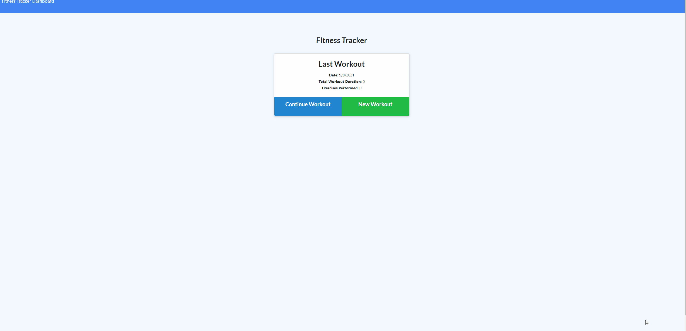

## Use

A user can enter a new workout, or add and exercise to a workout in progress.
also a User can view the last 7 workouts from the Dashboard page

## Deployment

https://intense-bayou-20743.herokuapp.com/
# Unit 17 NoSQL Homework: Workout Tracker

## Description
This is a Workout tracker application used for keeping a detailed log of your workouts for easy reference. Whether you want to set goals for yourself or just be a bit more organized with logs this app can help.
## Getting Started

Just go to the webpage and log your workouts. Simple as that.* [Click Here!](https://intense-bayou-20743.herokuapp.com/)

## How it Works
Just enter the workout and save it to your logs for easy tracking, simple as that!

## Built With

* [Mongoose](https://openweathermap.org/) - I used Open Weather Map to grab current and future weather of the location you select.
* [ORM](https://github.com/erikflowers/weather-icons/) - We used Erik Flowers' beautiful weather icons.
* [Node](https://bulma.io/documentation/) - I used Bulma CSS framework. 
* [Express](https://unsplash.com/) - I used copyright-free images from this site.
* [MongoDB](https://fonts.google.com/) .

## Author

Samuel Cordova